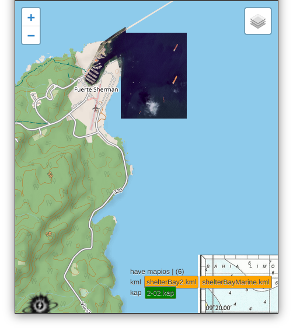

# viteyss-site-mapleaflet

Web map supportted by `leafletjs`. 

### dependency

- **imgkap** [link ...](https://github.com/nohal/imgkap)
In core when it handle kap files it use ***imgkap** software to split kap to mheader and png. Look file `kapHelp.js` and `pathToKmgKapSplit` change it to your path.

### can do

- basic map minimum clutter
- baseMaps from [OpenStreetMap](http://www.openstreetmap.org/copyright)
- proxy for tiles. So one time view online is accessable later offline. For hosts tailing services, configs in `onlineMaps.js`
- look for chart's files **kap**, **kml** files. Definition where to look for file naw is in `api_mapleaflet.js` `mapioFolders` array

### screenshot

First draft `250906`
