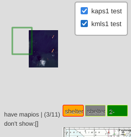

# viteyss-site-mapleaflet

Web map supportted by `leafletjs`. 

### screenshot


First draft `25090610`

### what can do

- as vue / old style module
- can be as split / multiple one one site
- options on init
- basic map minimum clutter
- baseMaps from [OpenStreetMap](http://www.openstreetmap.org/copyright)
- fullscreen button
- proxy for tiles. So one time view online is accessable later as **offline**. For hosts tailing services, configs in `onlineMaps.js`
- tile layer fallback
- chart's files *.kap, **.kml (as raster and vector *.svg) in local directories
  - charts can be filterd
  - force to show / hide
  - as png, svg with alpha channel
- loads gpx, kml, ... **files to traks** on client site
- process data to geo json
- help grid of lat, lng
- copy lat,lng location to clipboard
- gui widget's with options. Look section options `on init`
- context menu
  - [x] menure distance
- depth sounding overlays

### dependency

- **imgkap** [link ...](https://github.com/nohal/imgkap)
  In core when it handle kap files it use ***imgkap** software to split kap to mheader and png. Look file `kapHelp.js` and `pathToKmgKapSplit` change it to your path.

### used libraries

Libraries are comming prefetchd. So are comming with viteyss-site-mapleatlet. Cas be found in `./assets` directory.

[leaflet.fullscreen](https://github.com/brunob/leaflet.fullscreen) | [leaflet.filelayer.js](https://github.com/makinacorpus/Leaflet.FileLayer) | [togeojson.js](https://github.com/mapbox/togeojson) | [leaflet.js](https://leafletjs.com) | [vue.js](https://vuejs.org/) | [leaflet.TileLayer.Fallback](https://github.com/ghybs/Leaflet.TileLayer.Fallback/tree/master) | [leaflet.contextmenu](https://aratcliffe.github.io/Leaflet.contextmenu/examples/index.html) | [leaflet.latlng-graticule.js](https://github.com/Leaflet/Leaflet.Graticule?tab=readme-ov-file)

### charts - local file system

Definition where it looks for file now is in `api_mapleaflet.js` `mapioFolders` array. Add them as overlay.
Can do: *.kap, *.kml, *.svg



**Filtering** by source as directory where it was found.
**Forcing** show / hide by clicking on map item
**Borders** to show posible chart
**shows / hides** automaticaly chart base on `%` of area it takes on screen

#### charts - using SASPlanet

There is a `setting` for tile provider of local proxy. So using sasplanet you cat force it to cashe areas using it.
Settings files can be found in project directory:
`./examples/SASPlanet_settings/Aing_Sat.zmp`

### tracks local file system

* can load file from client as overlay.
* TODO look for local files and present them with manager

### dbSoundings - depthLoger overlay

[ working need more work ] **depthSoundings** custam geoJSON overlay showing customizable depths readings from `sonar` akt depth sounder from a `leisure water craft`


    
I did some readings and `../LogDepth.db` is sqlite3 powerd data base. Link to project [depthLoger](https://github.com/yOyOeK1/depthLoger) and my [depthLogerDB](https://github.com/yOyOeK1/depthLogerDB)
    Do you have any reading to share ? 
    Or you have a depth sounder in your bilge / locker and you want to send it to me?
    
It can be set:
- custom alert depth where readings are show red (don't go area)
- size / accuracity of grid ( all need to be simplifaid )
- TB
    

### about proxy for tiles

Proxy it's is in beatwean you and internet. Only for time when you look for map's with it, will downlad what you need to have on the map as tiles. Provide you with needed tiles and store it on hard drive. But first it looks for files in a hard drive for all yours visited spots. When file is there then use this one. If file is not pressent then try to connect to internet to download it. Imitates that ther is a internet and you can see what was in stored local proxy files.

Used base maps are `raster` so images with pixels. This image is calld `tile` Every image is 256x256. And from this tiles side by side row by row thay create a ilusion of a biger image of a desire map.

### options on init - xdoc

Example will be init of main `mapioMapio.vue` to `div`

```js
this.mioApp = createApp( MapioMapio,  
    {
        'mapname':"mio",            // name must be `id` name skeam ok
        'mapOpts':{'abc':1,
            'zoomControl': false,
            'center': [9.2620320938,-79.9355079], 'zoom':12
        },
        'addSmallLatLon': true, 
        'addFullScreenBt': true,
        'addFallbackTiles': false, 
        'addGrid': true,
        'addContextMenu': contextMenuSimple( this.homeUrl ), // look as a example
        'fileLoad': false, 'homeUrl': this.homeUrl,  
        'addlfBaseMaps': true,
        'useHash': true,             // urlhash to store and restore
        'depthSoundings': '../conturesTest/LogDepth.db' // db Soundings 
    } ).mount('#lfmapio');

        // `#lfmapio` - div where it will land 
        //              it need to provide correct style of div element
```

- [x] **addContextMenu** custome menu context on right / longpress
  

  
*contextMenuSimple.js* show simple menu and options for customization.

- [x] mesure distance
    

    
POI's are dragable.


### ideas

- [x] button slots

- [1/2] mesure distance / bearing
  * https://ppete2.github.io/Leaflet.PolylineMeasure/demo1.html
  * https://blog.cyclemap.link/Leaflet.Geodesic/basic-interactive.html

- [ ] track from client ico uniformd
- [ ] tracks
  - [ ] load from directory
  - [ ] show / hide manager
  - [ ] build track?
- [ ] weakLock option
- [ ] split screen option
  - [x] mirror location
  - [ ] way to controll it :)
- [ ] overlay for gui as
  - [x] svg
  - [ ] html

### multiSvg as osd


On left **inkscape** editing svg of osd.
Or right **viteyss** running viteyss-site-mapleaflet with svgOSD :) using power of [multiSVG from oiyshTerminal](https://github.com/yOyOeK1/oiyshTerminal/tree/main/ySS_calibration/sites/multiSVG)

### to fix

- [ ] map tile fallback now will looc in CyclOSM tiles.
    so if you have black tiles now in offline white tiles can show up 
- [x] file load gpx will not add track to overlayer list.
